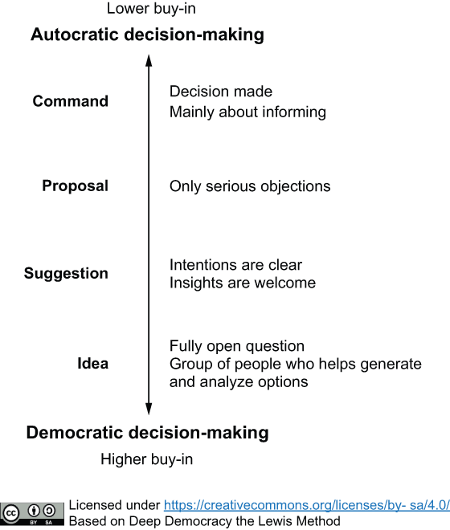

Clearly communicate the decision-making process being used for any given choice. If a leader has already made a decision, they should state it directly rather than creating a false pretense of seeking input. This respects people's time and avoids breeding cynicism. We can categorise four different decision-making types and we can use the following scale to communicate it to people:

## Example(s)

A CTO, having decided to adopt a new technology, informs the team of the decision and its rationale. This is preferable to asking for their opinion on the matter as if the choice were still open.
