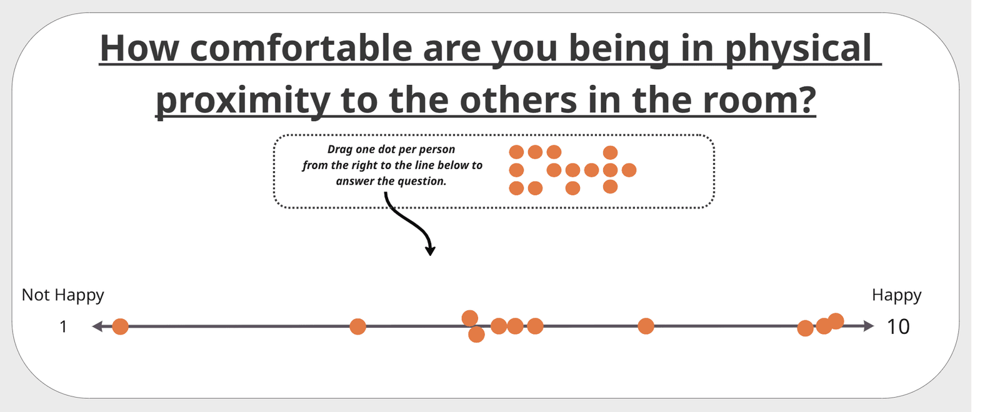

Augment formal decision records, like ADRs, with qualitative data about the human element. Include fields for the team's sentiment, confidence level, or readiness to commit to the decision. This provides crucial context for future reviews and helps gauge the true level of alignment.

## Example(s)

- In addition to the technical rationale, an ADR includes a section stating: "The team feels frustrated but accepts this as the least bad option for now." This captures important context that the technical details alone would miss.

- We can add a sense-making that states: On a scale of 1-10, how happy are you with this decision?

