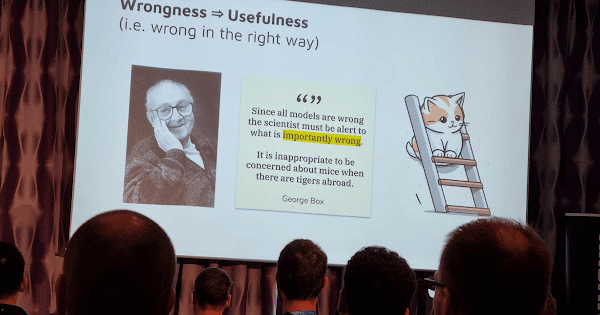

Focus architectural oversight on decisions with long-lasting, severe impact ('tigers') rather than on smaller, correctable mistakes ('mice'). Wasting political and emotional capital on minor issues is counterproductive when major systemic risks exist. This approach grants teams autonomy on less critical decisions.

### Examples

The team's poor event design was a 'mouse' because it created waste but did not threaten the entire system's viability. Therefore, it was an acceptable area for the team to make a mistake and learn from it.

