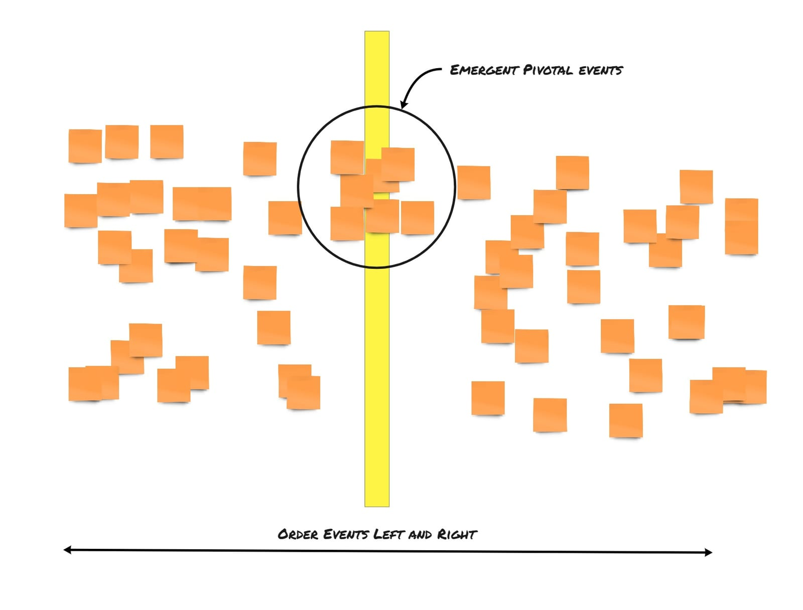

## Description

After a chaotic exploration for a big picture eventstorming, we can have over 2-300 domain events on our paper roll. To start sorting and structuring these domain events, we use a pattern called Pivotal or key events. These are events that the group and especially the domain events recognise in the flow that means a lot to them. Something that you can say, from this point onwards all the other stuff can happen. The trouble is, sometimes people find it hard to pinpoint them already. Of course, we should tell that they can always be changed; only people sometimes feel such a decision can be permanent.

## Summary of the solution

We can use the emerging pivotal events that we can take a group of events and start enforcing the timeline from there. Using the emerging pivotal events, we don't lock ourself to a more definitive decision, which eases some people but can unblock, move on and start sorting the domain events on the timeline, enforcing the timeline.

## remote eventstorming

In a remote Big Picture eventstorming we can put people in break-out rooms based on these pivotal events. What we observe is that even then it get's even more important not to lock down to much on these pivotal events.
