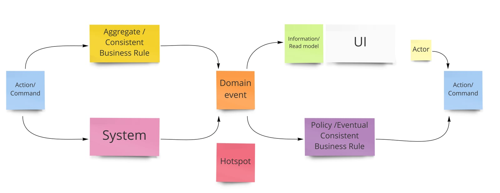

We can start a process or design EventStorming is two ways:

1. During an EventStorming session the group starts with a chaotic exploration of all the Domain Events. The next step is enforcing the timeline and create a consistent timeline. We continue until we completed the whole story line as a single flow, marking different cases with the hotspots. Since we explored enough we can now start playing by the colour coding rules, starting from the front and follow the colour pattern from the book.

2. Start with a starting Domain Event and mark an end Domain Event and work from there with the colour coding pattern.

## Examples

1. When there is not enough concepts popping up during enforcing the timeline, we can enforce more exploration and discussion by converting towards the colour coding pattern.

2. When the group is already experienced with EventStorming we can start straight away with the pattern.

3. When we explored the story in a previous EventStorming session we can start straight away with the pattern but with different starts and ending.

## Context

Use it during a process or design level EventStorming, when we need to be more explicit.
